<p align="center">
  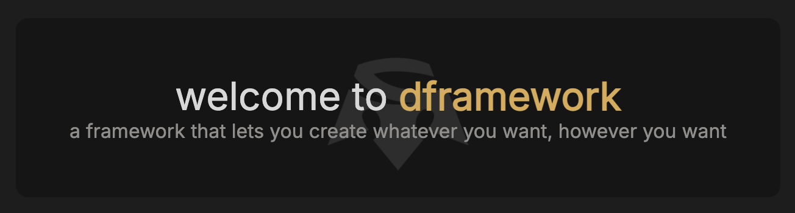
</p>

## Table of Contents

1. [Introduction](#introduction)
2. [Installation](#installation)
3. [Getting started](#getting-started)
4. [Core commands](#core-commands)
   - [init](#init)
   - [config](#config)
   - [serve](#serve)
   - [build](#build)
5. [Resource creation](#resource-creation)
   - [function](#create-function)
   - [component](#create-component)
   - [manager](#create-manager)
   - [script](#create-script)
   - [page](#create-page)
   - [style](#create-style)
6. [Configuration management](#configuration-management)
   - [Blacklist management](#blacklist-management)
   - [Exceptions management](#exceptions-management)
   - [Entries management](#entries-management)
7. [Configuration options](#configuration-options)
8. [Project structure](#project-structure)
9. [CSS utility classes](#css-classes)
10. [JS utility functions](#js-functions)
11. [Components](#components)
   - [dButton](#dbutton)
   - [dCheckbox](#dcheckbox)
   - [dColorPicker](#dcolorpicker)
   - [dCombobox](#dcombobox)
   - [dContextMenu](#dcontextmenu)
   - [dDrawer](#ddrawer)
   - [dDropdown](#ddropdown)
   - [dIconButton](#diconbutton)
   - [dImageInput](#dimageinput)
   - [dModal](#dmodal)
   - [dNotification](#dnotification)
   - [dScroll](#dscroll)
   - [dSlider](#dslider)
   - [dTextInput](#dtextinput)
   - [dToggle](#dtoggle)
   - [dLoader](#dloader)
12. [Advanced features](#advanced-features)
    - [Routing](#routing)
    - [Mongo DB API](#mongo-db)
13. [Contributing](#contributing)
14. [License](#license)

## Introduction

dframework is a lightweight JavaScript framework for building modern web applications with minimal configuration. It provides a CLI tool (`dstrn`) to help with project initialization, development, and building.

## Installation

```bash
npm install -g @dstrn825/dframework
```

## Getting started

To start a new project:

```bash
dstrn init
```
## Core commands

### init

Initializes a new dframework project in the current directory.

```bash
dstrn init
```

After initialization, you can configure your project using the `dstrn config` command.

### config

Configures a new dframework project interactively.

```bash
dstrn config
```

This command:
- guides you through setting up your project configuration via interactive prompts
- allows you to specify input/output directories, minification options, and other build settings
- must be run after the initial `dstrn init` command to properly configure your project

### serve

Starts a local development server for your project.

```bash
dstrn serve
```

This command:
- launches a development server on port 8250
- automatically loads and serves any cloud functions in your project
- provides real-time feedback on server activity and requests
- supports URL rewrites

The server is accessible at `http://localhost:8250`.

### build

Builds your project for production deployment.

```bash
dstrn build
```

## Resource creation

dframework provides several commands to create different types of resources for your project. Each command initiates an interactive prompt to gather information about the resource you want to create.

### function

Creates a serverless function with optional database and utility access.

```bash
dstrn create function
```

Functions are structured as serverless handlers with proper error handling and can interact with the database using the MongoAPI if enabled.

### component

Creates a web component with optional event emitter functionality.

```bash
dstrn create component
```

Components are based on the web components standard and can be customized with attributes, methods, and event listeners.

### manager

Creates a manager object for state or feature management.

```bash
dstrn create manager
```

Managers are singleton JavaScript objects that can be used for state management, feature coordination, or as service providers.

### script

Creates a JavaScript file with optional bundling and page integration.

```bash
dstrn create script
```

Scripts can be included in all pages, specific pages, or none.

### page

Creates an HTML page with optional routing configuration.

```bash
dstrn create page
```

Pages can be automatically wired up to the routing system if enabled.

### style

Creates a CSS stylesheet with optional bundling.

```bash
dstrn create style
```

Stylesheets can be bundled together for optimized delivery or kept separate.

## Configuration management

Configuration management in dframework allows you to customize how your project is built.

The configuration file is `dstrn.conf.js` which is created when you run `dstrn init` and can be modified through `dstrn config` or by directly editing the file.

### Blacklist management

Blacklist management allows you to exclude specific files and directories from the build process:

```javascript
// dstrn.conf.js
module.exports = {
  // other config options...
  "blacklist": [
    "node_modules/",
    ".netlify/", 
    ".vscode/",

    "file.js",
    "folder/"
  ]
}
```

Blacklisted paths can be modified using the blacklist command: `dstrn blacklist add/remove <path>`

### Exceptions management

Exceptions define paths that should be excluded from the bundling, minifying and obfuscating process:

```javascript
// dstrn.conf.js
module.exports = {
  // other config options...
  "exceptions": [
    "functions/",

    "file.js",
    "folder/"
  ]
}
```

Excepted paths can be modified using the exceptions command: `dstrn exceptions add/remove <path>`

### Entries management

Entries specify HTML entry files where bundled JS and CSS should be imported:

```javascript
// dstrn.conf.js
module.exports = {
  // other config options...
  "entries": [
    "./views/index.html"
  ]
}
```

Entry points can be modified using the entries command: `dstrn entries add/remove <path>`
Multiple entries can be specified for multi-page applications.

## Configuration options

dframework provides configuration options in the `dstrn.conf.js` file. You can modify these settings using the `dstrn config` command or by editing the file directly.

| Option | Type | Default | Description |
|--------|------|---------|-------------|
| `inputDir` | String | `./` | The source directory containing your project files |
| `outputDir` | String | `./build/` | The directory where built files will be placed |
| `minify` | Boolean | `true` | Enable JavaScript and CSS minification |
| `obfuscate` | Boolean | `true` | Enable code obfuscation |
| `moveWASMToRoot` | Boolean | `true` | Move WebAssembly (WASM) files to the root directory for better compatibility |
| `apiEndpoint` | String | `/api` | The endpoint path for API requests |
| `useRouter` | Boolean | `true` | Enable the web history router for single-page application routing |
| `cssBundle` | Array | `[]` | List of CSS files to bundle together |
| `jsBundle` | Array | `[]` | List of JavaScript files to bundle together |
| `entries` | Array | `[]` | HTML files to process as entry points |
| `exceptions` | Array | `["functions/"]` | Files or directories to exclude from processing |
| `blacklist` | Array | `["node_modules/", "build/", ".netlify/", ".vscode/", ".gitignore", "dstrn.conf.js"]` | Files or directories to exclude from the build |

## Project structure

The dframework project structure follows a modular organization as follows:

```
project-root/
├── functions/              # reusable JavaScript functions
│   ├── example/            # example function implementations
│   └── lib/                # library-specific functions
│
├── lib/                    # core framework libraries
│   ├── dstrn.css           # core CSS framework styles
│   └── dstrn.js            # core JavaScript framework functionality
│
├── public/                 # public assets served directly
│   ├── assets/             # image and file assets
│   ├── css/                # compiled and third-party CSS files
│   └── js/                 # compiled and third-party JavaScript files
│
├── views/                  # HTML templates and view files
│   ├── error.html          # error page template
│   └── index.html          # main entry point HTML template
│
├── dstrn.conf.js           # framework configuration file
└── .gitignore              # git ignore configuration
```

## CSS utility classes

dframework provides a comprehensive set of utility classes to help you style your applications quickly and consistently. The utility classes follow a simple naming convention and are organized into categories for easy use.

### Theming

- **Theme classes**: `.dark-theme`, `.bright-theme`
- **Color variables**:
  - Base colors: `--base`, `--container-1` through `--container-4`
  - Accent colors: `--accent-1`, `--accent-2`, `--accent-3`, `--inactive-accent`
  - Text colors: `--link-color`, `--binary-color`, `--primary-text`, `--secondary-text`, `--indicator-text`
  More color variables and themes can always be added.

### Layout utilities

#### Display
- **Basic display**: `.d-none`, `.d-block`, `.d-inline`, `.d-inline-block`, `.d-grid`, `.d-contents`
- **Table display**: `.d-table`, `.d-table-cell`, `.d-table-row`

#### Flexbox
- **Container types**: `.flex-row`, `.flex-column`, `.flex-center`
- **Flex properties**: `.flex-1`, `.flex-0`, `.flex-wrap`, `.flex-grow`
- **Justify content**: `.justify-between`, `.justify-around`, `.justify-evenly`, `.justify-center`, `.justify-start`, `.justify-end`
- **Align items**: `.align-between`, `.align-around`, `.align-evenly`, `.align-center`, `.align-start`, `.align-end`
- **Gap utilities**: `.g-0`, `.g-05`, `.g-1`, `.g-2`, `.g-3`, `.g-4`, `.g-5` (in 1em increments)

### Positioning

- **Position type**: `.relative`, `.fixed`, `.sticky`, `.absolute`
- **Special positioning**: `.absolute-center`, `.absolute-fill`
- **Edge positioning**: `.top-0`, `.bottom-0`, `.left-0`, `.right-0`
- **Transform utilities**: `.translateX`, `.translateY`

### Sizing utilities

#### Width
- **Percentage width**: `.w-5` through `.w-100` (in 5% increments), `.w-100vw`
- **Special width**: `.w-auto`, `.w-fit`, `.w-min`, `.w-max`, `.w-fill`
- **Min/max width**: `.min-w-*`, `.max-w-*` (same increments as width)

#### Height
- **Percentage height**: `.h-5` through `.h-100` (in 5% increments), `.h-100svh`
- **Special height**: `.h-auto`, `.h-fit`, `.h-min`, `.h-max`, `.h-fill`
- **Min/max height**: `.min-h-*`, `.max-h-*` (same increments as height)

### Spacing utilities

#### Padding
- **All sides**: `.p-0`, `.p-05`, `.p-1`, `.p-2`, `.p-3`, `.p-4`, `.p-5` (in 1em increments)
- **Vertical/horizontal**: `.py-*`, `.px-*` (in 1em increments)
- **Individual sides**: `.pt-*` (top), `.pb-*` (bottom), `.pl-*` (left), `.pr-*` (right)

#### Margin
- **All sides**: `.m-0`, `.m-05`, `.m-1`, `.m-2`, `.m-3`, `.m-4`, `.m-5`, `.m-auto` (in 1em increments)
- **Vertical/horizontal**: `.my-*`, `.mx-*` (including `.mx-auto` for centering)
- **Individual sides**: `.mt-*` (top), `.mb-*` (bottom), `.ml-*` (left), `.mr-*` (right)

### Typography

- **Font size**: `.fs-05` through `.fs-10` (various increments)
- **Text alignment**: `.text-center`
- **Text style**: `.bold`, `.thin`
- **Text orientation**: `.text-vertical`
- **Overflow text**: `.overflow-ellipsis`

### Visual styling

#### Colors
- **Background colors**: `.bg-base`, `.bg-container-1` through `.bg-container-4`, `.bg-accent-1`, `.bg-accent-2`, `.bg-accent-3`, `.bg-inactive`, `.bg-binary`
- **Text colors**: `.text-link`, `.text-base`, `.text-binary`, `.text-primary`, `.text-secondary`, `.text-indicator`, `.text-accent-1`, `.text-accent-2`, `.text-accent-3`, `.text-inactive`
- **Hover states**: `.hover-bg-*`, `.hover-text-*`

#### Visual properties
- **Border radius**: `.bdr-0`, `.bdr-05`, `.bdr-1`, `.bdr-2`, `.bdr-3`, `.bdr-4`, `.bdr-5`, `.bdr-circle`
- **Opacity**: `.opacity-0` through `.opacity-100` (in 10% increments)
- **Background image**: `.bg-cover`, `.bg-contain`
- **Aspect ratio**: `.square` (1:1 aspect ratio)

### Overflow & scrolling

- **General overflow**: `.overflow-hidden`, `.overflow-scroll`, `.overflow-auto`, `.overflow-visible`
- **Axis-specific**: `.overflow-x-*`, `.overflow-y-*`
- custom scrollbar styling included by default

### Interaction utilities

- **Cursor types**: `.pointer`, `.not-allowed`
- **Style resets**: `.no-decorations`, `.no-outline`, `.no-border`
- **Transitions**: `.tr-1` through `.tr-10`, `.click-haptic`, `.click-haptic-med`, `.click-haptic-small`
- **Animation control**: `.preload` (prevents animations during page load)

### Usage examples

```html
<!-- centered flex container -->
<div class="flex-center p-2 g-1">
  <!-- colored button with hover effect -->
  <button class="bg-accent-1 text-binary hover-bg-accent-2 p-1 bdr-1">button</button>
  
  <!-- auto-sized container with shadow -->
  <div class="w-fit h-auto p-2 m-1">content here</div>
</div>

<!-- absolutely positioned element at bottom right -->
<div class="absolute bottom-0 right-0 m-2">footer</div>
```

## JavaScript utility functions

dframework provides a set of utility functions to simplify common JavaScript operations:

### DOM manipulation
- `select(selector, scope)` - query selector wrapper
- `selectAll(selector, scope)` - query selector all wrapper that returns an array
- `listen(target, event, callback, ...options)` - event listener
- `listenAll(targets, event, callback, ...options)` - add event listener to multiple elements

### Class management
- `addClass(element, className)` - add a CSS class
- `removeClass(element, className)` - remove a CSS class
- `toggleClass(element, className)` - toggle a CSS class

### Array and string operations
- `move(input, from, to)` - move item in array or character in string
- `remove(input, index)` - remove item at index
- `replace(input, index, newItem)` - replace item at index
- `limit(input, limit)` - limit array length or string length
- `uniquify(input)` - remove duplicates from array or string
- `asyncForEach(array, callback)` - async version of forEach

### Type checking
- `isUndefined(value)` - check if value is undefined
- `isNull(value)` - check if value is null
- `isBoolean(value)` - check if value is boolean
- `isNumber(value)` - check if value is number
- `isInteger(value)` - check if value is integer
- `isString(value)` - check if value is string
- `isEmpty(value)` - check if string or array is empty
- `isFunction(value)` - check if value is function
- `isArray(value)` - check if value is array
- `isObject(value)` - check if value is object
- `hasValue(value)` - check if value exists (not empty, null, or undefined)

### Utility functions
- `random(min, max)` - generate random integer between min and max
- `storage.get(key, defaultValue)` - get item from localStorage
- `storage.set(key, value)` - set item in localStorage
- `storage.remove(key)` - remove item from localStorage
- `storage.clear()` - clear localStorage
- `sleep(milliseconds)` - promise-based delay
- `clipboard(text)` - copy text to clipboard
- `uniqueId(length)` - generate unique ID
- `distance(a, b)` - calculates the difference between 2 strings, 2 arrays or 2 objects.
- `formatDate(value)` - formats any date or date string into a readable format.
- `localizeDate(value)` - converts any date or date string into the local timezone.

## Components

dframework provides several custom HTML components. These components offer reusable UI elements with consistent styling and behavior.

### dButton

<p align="center">
  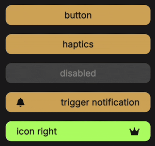
</p>

Button component with icon support.

**Attributes:**
- `text` - button text
- `icon` - font awesome icon class
- `iconPosition` - position of the icon ("left" or "right", default: "left")
- `color` - button background color
- `textColor` - button text color
- `hoverColor` - button hover background color
- `hoverTextColor` - button hover text color
- `disabledColor` - button disabled background color
- `disabledTextColor` - button disabled text color
- `haptics` - enable haptic feedback on click
- `disabled` - set button to disabled state

**Methods:**
- `setDisabled(toggle)` - enable/disable the button
- `setText(text)` - change the button text
- `setIcon(icon)` - change the button icon
- `setColor(color)` - change the button background color
- `setTextColor(color)` - change the button text color
- `setHoverColor(color)` - change the button hover background color
- `setHoverTextColor(color)` - change the button hover text color

**Usage:**
```html
<d-button text="submit" icon="fa-solid fa-paper-plane" haptics></d-button>
```

### dCheckbox

<p align="center">
  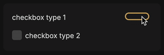
</p>

**Attributes:**
- `type` - checkbox style (1: toggle switch, 2: checkmark box, default: 1)
- `text` - checkbox text
- `activeColor` - active state color
- `textColor` - label text color
- `inactiveColor` - inactive state color

**Methods:**
- `setText(text)` - change the checkbox text
- `setActiveColor(color)` - change the active state color
- `setInactiveColor(color)` - change the inactive state color
- `setTextColor(color)` - change the label text color

**Events:**
- `change` - fired when checkbox state changes

**Usage:**
```html
<d-checkbox text="enable something" type="1"></d-checkbox>
```

### dColorPicker

<p align="center">
  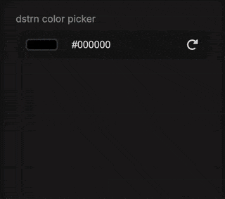
</p>

**Attributes:**
- `name` - color picker label
- `value` - initial color value (default: "#000000")
- `colorId` - id for the color input field (default: "color0")
- `opened` - whether the color picker is initially opened
- `haptics` - enable haptic feedback on selection

**Methods:**
- `set(value)` - set the color value
- `get()` - get the current color value

**Events:**
- `colorchange` - fired when color value changes

**Usage:**
```html
<d-color-picker value="#FF5733" name="theme color"></d-color-picker>
```

### dCombobox

<p align="center">
  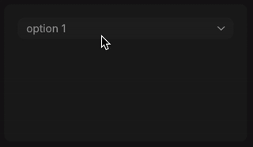
</p>

Combobox component with optional input support.

**Attributes:**
- `options` - JSON string of options array with format `[{value: "value1", text: "text 1"}, ...]`
- `allowInput` - allow text input in the dropdown
- `haptics` - enable haptic feedback on selection

**Methods:**
- `setOptions(options)` - update the available options
- `set(value)` - set the selected value
- `get()` - get the currently selected value

**Events:**
- `change` - fired when selection changes

**Usage:**
```html
<d-combobox options='[{"value":"red","text":"Red"},{"value":"green","text":"Green"},{"value":"blue","text":"Blue"}]'></d-combobox>
```

### dContextMenu

<p align="center">
  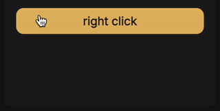
</p>

Context menu component that appears on right-click.

**Methods:**
- `openCloseMenu(event)` - open or close the context menu
- `openMenu()` - open the context menu
- `closeMenu()` - close the context menu

**Events:**
- `click` - fired when a context menu item is clicked

**Usage:**
```html
<div>
  right click
  <d-context-menu>
    <span>option 1</span>
    <span>option 2</span>
    <span>option 3</span>
  </d-context-menu>
</div>
```

### dDrawer

<p align="center">
  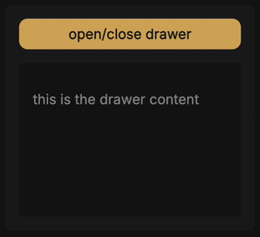
</p>

Slide-out drawer component for additional content or navigation.

**Attributes:**
- `direction` - direction from which the drawer appears ("top", "right", "bottom", "left", default: "right")
- `opened` - whether the drawer is initially opened

**Methods:**
- `handleOpenClose()` - toggle the drawer open/closed state

**Usage:**
```html
<d-drawer direction="left">
  <div class="p-2">
    <h3>drawer example</h3>
    <ul>
      <li>home</li>
      <li>about</li>
      <li>contact</li>
    </ul>
  </div>
</d-drawer>
```

### dDropdown

<p align="center">
  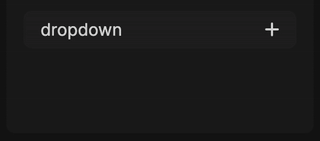
</p>

Collapsible dropdown component for grouping content.

**Attributes:**
- `header` - text for the dropdown header
- `opened` - whether the dropdown is initially opened
- `haptics` - enable haptic feedback on toggle

**Methods:**
- `handleOpenClose()` - toggle the dropdown open/closed state

**Usage:**
```html
<d-dropdown header="dropdown example">
  <div class="p-2">
    <p>content goes here</p>
  </div>
</d-dropdown>
```

### dIconButton

<p align="center">
  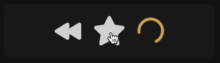
</p>

**Attributes:**
- `icon` - font awesome icon class
- `size` - font size of the icon
- `color` - icon color
- `activeColor` - active state color
- `loader` - enable loading state capability
- `loading` - set initial loading state

**Methods:**
- `switchState(removeClass, addClass)` - switch between icon states
- `change(icon)` - change the icon
- `setLoading(state)` - set the loading state

**Usage:**
```html
<d-icon-button icon="fa-solid fa-heart" loader></d-icon-button>
```

### dImageInput

<p align="center">
  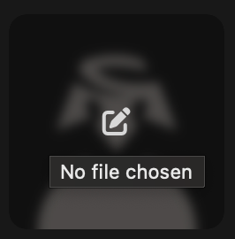
</p>

Input component for selecting and previewing images.

**Attributes:**
- `accept` - file types to accept
- `icon` - icon for the upload button

**Methods:**
- `reset()` - clear the selected image

**Events:**
- `change` - fired when an image is selected

**Usage:**
```html
<d-image-input accept="image/png, image/jpeg"></d-image-input>
```

### dModal

<p align="center">
  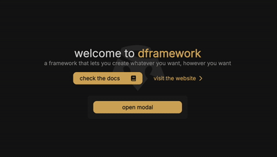
</p>

**Attributes:**
- `opened` - whether the modal is initially opened

**Methods:**
- `open()` - open the modal
- `close()` - close the modal

**Usage:**
```html
<d-modal>
  <div class="p-3">
    <h3>modal title</h3>
    <p>modal content goes here</p>
    <d-button text="close"></d-button>
  </div>
</d-modal>
```

### dNotification

<p align="center">
  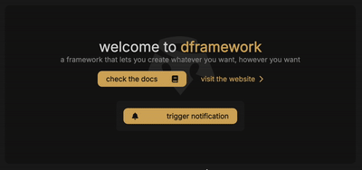
</p>

Notification component for displaying alerts or messages.

**Attributes:**
- `opened` - whether the notification is initially shown

**Methods:**
- `show()` - display the notification
- `hide()` - hide the notification
- `destroy()` - remove the notification from the DOM

**Usage:**
```html
<d-notification>
  <div class="p-2 bg-accent-1">
    <h4>notification</h4>
    <p>more content here</p>
  </div>
</d-notification>
```

### dScroll

<p align="center">
  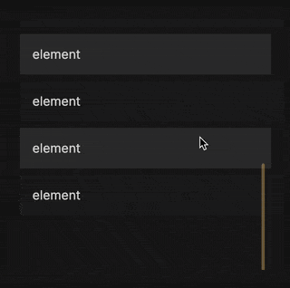
</p>

Custom scrolling container with a bouncing effect like on MacOS and iOS.

**Attributes:**
- `direction` - scroll direction
- `scrollbar-color` - scrollbar color
- `scrollbar-hover-color` - scrollbar hover color
- `thumb-width` - width of the scrollbar thumb
- `thumb-hover-width` - width of the scrollbar thumb on hover
- `scrollbar-width` - width of the scrollbar track
- `margin-top` - top margin for the scrollable content
- `margin-bottom` - bottom margin for the scrollable content
- `margin-side` - side margin for the scrollbar

**Methods:**
- `updateScrollbar()` - update the scrollbar position and size
- `scrollTo(position)` - scroll to a specific position
- `append(element)` - add an element to the scrollable content

**Usage:**
```html
<d-scroll style="height: 300px;">
  <div class="p-2">
    <p>scrollable content goes here</p>
    <!-- more content -->
  </div>
</d-scroll>
```

### dSlider

<p align="center">
  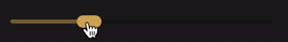
</p>

**Attributes:**
- `min` - minimum value
- `max` - maximum value
- `step` - step increment
- `value` - initial value
- `thumbColor` - thumb color
- `fillColor` - fill color
- `trackColor` - track color
- `sfx` - enable sound effects on slide

**Methods:**
- `getValue()` - get the current slider value
- `setValue(value)` - set the slider value

**Events:**
- `change` - fired when slider value changes

**Usage:**
```html
<d-slider min="0" max="100" step="1" value="50" id="volume"></d-slider>
<span data-slider-volume>50%</span>
```

### dTextInput

<p align="center">
  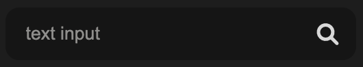
</p>

Text input component with optional icon.

**Attributes:**
- `placeholder` - input placeholder text
- `icon` - icon to display inside the input
- `autocomplete` - enable browser autocomplete
- `haptics` - enable haptic feedback on focus
- `password` - set input type to password

**Methods:**
- `getValue()` - get the current input value
- `setValue(value)` - set the input value

**Events:**
- `change` - fired when input value changes
- `keydown`, `keyup` - keyboard events
- `focus`, `blur` - focus events

**Usage:**
```html
<d-text-input placeholder="search" icon="fa-solid fa-search"></d-text-input>
```

### dToggle

<p align="center">
  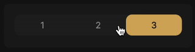
</p>

Toggle button group for selecting from multiple options.

**Attributes:**
- `color` - button color
- `activeColor` - active button color
- `textColor` - text color
- `textActiveColor` - active text color
- `bgColor` - background color
- `haptics` - enable haptic feedback on toggle

**Methods:**
- `set(toggle)` - set the active toggle (by index or element)
- `get()` - get the currently active toggle element

**Events:**
- `change` - fired when selection changes

**Usage:**
```html
<d-toggle>
  <div toggle-default>option 1</div>
  <div>option 2</div>
  <div>option 3</div>
</d-toggle>
```

### dLoader

<p align="center">
  
</p>

Simple loading spinner component.

**Usage:**
```html
<d-loader></d-loader>
```

## Advanced features

### Routing

dframework includes a built-in routing system for creating single-page applications with client-side navigation.

#### Features

- history API based routing for clean urls
- automatic page transitions with optional animations
- route parameters and query string parsing
- programmatic navigation API
- no page reloads

#### Configuration

To enable single-page routing, simply run the command `dstrn config` and select "yes" when prompted with `use the web history router?`.

After this, a new `router.js` file will be created in the root directory of your project.

You can create template HTML files and load them, as well as reload page scripts, when navigating to a new route.

To define a new route, use the following structure:

```javascript
// router.js
router.on('/xxx', function () {
  render("views/xxx.html", ["public/js/xxx.js"]);
});
```

This code defines the `/xxx` route, renders the `xxx.html` template, and reloads the `xxx.js` script when the route is accessed.

#### Custom page transition

When working with a single-page web application it is possible to customize the CSS transition that's played when switching pages.

To do so, you can simply create a custom render() function.

```javascript
// router.js
const router = new dRouter('/');
router.controller = null;

const render = (template, scripts) => {
  return new Promise((resolve, reject) => {
    if(router.controller) { router.controller.abort(); router.controller = null };
    router.controller = new AbortController();
    const signal = controller.signal;
    
    // your code to run at the start of the transition

    fetch("../"+template, { signal })
      .then(response => {
        if (!response.ok) {
          throw new Error(`failed to fetch ${template}: ${response.status}`);
        }
        return response.text();
      })
      .then(html => {
        setTimeout(() => { // using fake delay for the animation (optional)
          contentContainer.innerHTML = html;
          const existingScripts = document.querySelectorAll("script[data-page-script]");
          existingScripts.forEach(script => script.remove());
  
          if (scripts && scripts.length > 0) {
            let scriptsLoaded = 0;
  
            scripts.forEach((url) => {
              const script = document.createElement("script");
              script.src = "../" + url + '?cachebuster=' + new Date().getTime();
              script.dataset.pageScript = true;
              script.onload = () => {
                scriptsLoaded++;
                if (scriptsLoaded === scripts.length) {
                  resolve();
                }
              };
              document.body.appendChild(script);
            });
          } else {
            resolve();
          }
        // your code to end the transition
        }, 700);
      })
      .catch(error => {
        reject(error);
      });
  });
};

// example route
router.on('/', function () {
  render("views/index.html", ["public/js/index.js"]);
});
router.resolve();
```

### Mongo DB API

dframework provides a MongoDB API wrapper for easy integration with MongoDB databases.

#### Features

- support for multiple environments (development and production)
- connection pooling and automatic reconnection
- comprehensive operations
- simple async/await API

#### Configuration
To connect to your MongoDB servers simply open the file `/functions/lob/MongoAPI.js` and change the following files in the constructor:

```javascript
this.servers = {
    dev: "", // mongo server URL
    prod: "", // mongo server URL
};

this.dbName = ""; // your database name
```
You can also add more URLs if you own more servers and want to quickly be able to switch between them.

#### Usage

```javascript
// import the MongoDB API
const { MongoAPI } = require('../functions/lib/MongoAPI');

// initialize the API
const mongo = new MongoAPI();

// example operations
async function saveUser(user) {
  await mongo.connect();
  const result = await mongo.insertOne('users', user);
  await mongo.destroy();
  return result;
}

async function getUsers(query = {}) {
  await mongo.connect();
  const users = await mongo.find('users', query);
  await mongo.destroy();
  return users;
}
```

#### Available methods

- `connect()` - establish connection to MongoDB
- `find(collection, query, options)` - find documents in collection
- `findOne(collection, query, options)` - find a single document
- `insertOne(collection, document)` - insert a document
- `insertMany(collection, documents)` - insert multiple documents
- `updateOne(collection, filter, update, options)` - update a document
- `updateMany(collection, filter, update, options)` - update multiple documents
- `deleteOne(collection, filter, options)` - delete a document
- `deleteMany(collection, filter, options)` - delete multiple documents
- `destroy()` - close connection

## Contributing

### Development setup
```bash
git clone https://github.com/dstrn825/dframework.git
cd dframework
npm install
```

### Coding standards
don't be an idiot

### Pull request process

1. create a new branch for your feature:
   ```bash
   git checkout -b feature/your-feature
   ```

2. make your changes and commit with descriptive messages

3. update doc if necessary

4. push your branch and create a PR

## License

Copyright (c) 2025 dstrn

This work is licensed under the Creative Commons Attribution-NonCommercial-ShareAlike 4.0 International License.

To view a copy of this license, visit https://creativecommons.org/licenses/by-nc-sa/4.0/.